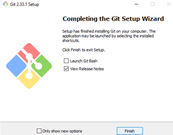

# install git 
## masuk pada browser ,dan download dulu git bash
atau klik [git bash](git-scm.com)

## install git bash 
setelah terdownload lalu install git bash

lalu akan muncul documen license dari git
klik next untuk melanjutkan instalasi

lalu akan muncul komponen tambahan untuk install git

lalu tunggu instalasi berjalan sampai selesai

lalu klik finish setelah instalasi selesai

## cek versi git
buka cmd pada windows

lalu masukan perintah berikut untuk mengecek apakah git sudah terinstall

'
git --version
'

jika git sudah berhasil terinstall, maka akan muncul tampilan seperti dibawah ini

# membuat repository

buka github pada browser 
atau klik [github](http://github.com)

## login github
setelah masuk ke git akan keluar tampilan berikut ini

apabila sudah memiliki akun langsung sign in pada github
masukan username dan password github .lalu klik sign in

## membuat repository baru

setelah berhasil login github ,lalu membuat repository .
klik tombol new pada menu repoositories untuk membuat repository baru

lalu isi nama, deskripsi, dan jenis repository , 
lalu centang add README.md
setelah selesai mengisi lalu klik create

## buat folder pada windows

selanjutnya buat folder baru pada local disk komputer untuk menyimpan update file dari repository yang telah dibuat

## buka folder menggunakan git bash

klik kanan pada folder yang telah dibuat .
lalu klik git bash here

 
lalu akan muncul tampilan dibawah ini

## clone repository 

masuk ke repository pada github
lalu klik code

dan salin alamat repository seperti pada gambar berikut

lalu masuk ke git bash lagi .
dan masukann perintah berikut

'
$ git clone *salinan dari url repository*
'

lalu akan muncul tampi;lan berikut

## rubah folder menjadi repository

lakukan perintah berikut agar folder menjadi repository

'
$ cd *nama repository*
'

lalu akan muncul tampilan sebagai berikut

## menambahkan file

pada git bash masukan perintah berikut

'
$ git add .
'

lalu akan muncul tampilan berikut

## buat commit

commit berfungsi menambahkan komentar pada file yang baru diupload.
masukan perintah berikut untuk membuat commit

'
$ git commit -m"*masukan coommit*"
'

kalian bebas memasukan nama commit .

## push ke github

masukan perintah berikut untuk push ke github

'
$ git push -u origin main
'

jika proses berhasil akan muncul tampilan sebagai berikut

